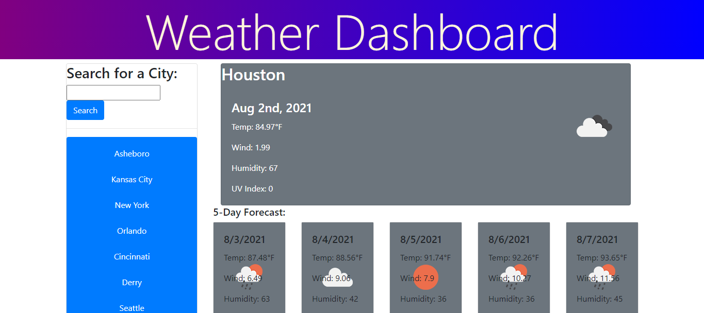

# Weather Station

  ## Description
  Created a weather app where a user can search for their city and receive the current day’s weather as well as a 5 day forecast. This project used chained api calls to provide the current weather and the 5 day forecast. This project was created using HTML, CSS, Bootstrap, JavaScript and openweather API.

  

  ## Table of Contents
- [Installation](#installation)
- [Usage](#usage)
- [Credits](#credits)
- [License](#license)

## Installation
No special steps required for use of application.

## Usage

None available

## Credits
Sole contributor.  https://openweathermap.org/api

## License
This project is covered by the [MIT](https://choosealicense.com/licenses/mit/) license.

## How to Contribute
*If you would like to contribute, you can follow these guidelines for how to do so.*

Please follow the [Contributor Covenant](https://www.contributor-covenant.org/)for contributions.

## Tests
No tests at this time.

## Questions
Please feel free to reach out and send any questions or comments to me at:

GitHub: https://github.com/aubrihenley

email: aubri.henley@gmail.com
