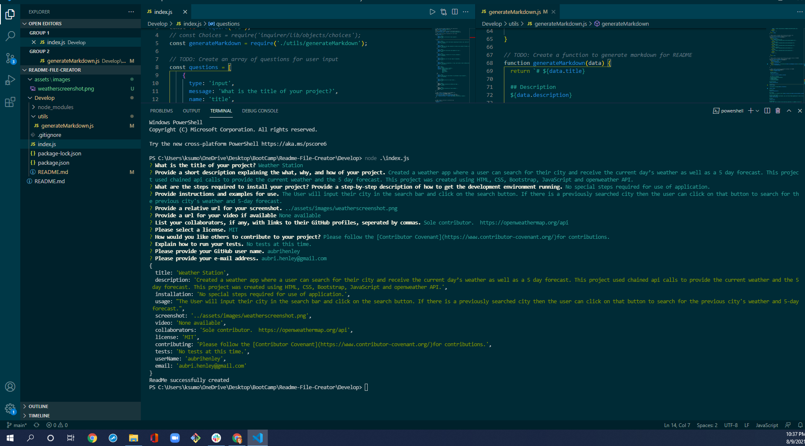

# Readme-File-Creator

## Description
The goal of this project was to create a professional readme file using inquirer prompts. Using this application allows for each README.md created to have a consistent format.
This was created using JavaScript, node.js, and inquirer.

## Table of Contents (Optional)
If your README is long, add a table of contents to make it easy for users to find what they need.
- [Installation](#installation)
- [Usage](#usage)
- [Credits](#credits)
- [License](#license)

## Installation
Before initializign the index.js you will need to do and npm install for inquirer.

## Usage
User will initialize index.js and fill out prompts as directed. See screenshot and video demonstration below.

[Demo Video](https://drive.google.com/file/d/1u-JnuiTlk82nsRtMeBea5tggZx7-KVU5/view)

## Credits
Sole creator: Aubri Henley

## License
This project is covered by the [MIT](https://choosealicense.com/licenses/mit/) license.

## How to Contribute
Please follow the [Contributor Covenant](https://www.contributor-covenant.org/) for contributions.

## Tests
No tests at this time.

## Questions
Please feel free to reach out and send any questions or comments to me at:

GitHub: https://github.com/aubrihenley

email: aubri.henley@gmail.com
